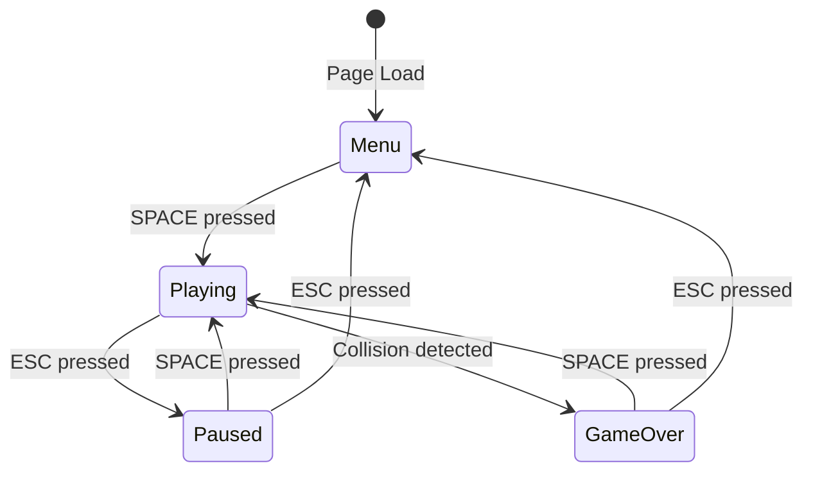

# Design Document: Flappy Kiro

## Overview

Flappy Kiro is a browser-based endless runner game built with HTML5 Canvas and vanilla JavaScript. The game implements a single-screen arcade experience where players control a ghost character navigating through procedurally generated pipe obstacles. The architecture follows a component-based design with clear separation between game logic, rendering, physics, and audio systems.

The game runs on a fixed 60 FPS game loop using requestAnimationFrame, ensuring consistent physics and smooth animations across different devices. All game state is managed centrally, with subsystems communicating through a simple event-driven architecture.

Key technical features:
- Canvas-based 2D rendering with particle effects
- Frame-independent physics simulation with gravity and momentum
- Precise AABB collision detection with visual feedback
- Multi-input support (keyboard, mouse, touch)
- Persistent high score storage using localStorage
- Audio system with sound effects and background music
- State machine for game flow (menu → playing → paused/game_over)

## Architecture

### System Components

The game is structured around six core subsystems:

**1. Game Configuration (GameConfig)**
- Centralizes all tunable game parameters
- Provides read-only access to configuration values
- Supports loading configuration from JSON file
- Organizes settings by category (physics, pipes, collision, audio, visual effects, etc.)
- Documents each parameter's purpose and valid ranges

**2. Game Engine (Core Loop)**
- Manages the main game loop using requestAnimationFrame
- Coordinates updates across all subsystems
- Maintains game state machine (menu, playing, paused, game_over)
- Handles initialization and resource loading
- Orchestrates frame timing and delta time calculations
- Loads and applies GameConfig on initialization

**3. Physics Engine**
- Applies gravity constant from GameConfig to ghost velocity
- Handles jump mechanics with ascent velocity from GameConfig
- Enforces terminal velocity limits from GameConfig
- Updates positions based on velocity each frame
- Preserves momentum between frames

**4. Collision Detector**
- Performs AABB intersection tests between ghost and pipes
- Checks boundary collisions (canvas edges)
- Triggers game over events on collision
- Manages invincibility period from GameConfig
- Executes collision checks post-physics, pre-render

**5. Rendering System**
- Clears and redraws canvas at 60 FPS
- Renders background, particles, pipes, ghost, and UI
- Applies visual effects (screen shake, red flash, color tints) using GameConfig parameters
- Manages particle system (trails and score indicators)
- Handles text rendering for scores and menus

**6. Audio System**
- Preloads and manages audio assets (jump, score, game_over, background music)
- Plays sound effects with volumes from GameConfig
- Controls background music loop with fade in/out
- Handles pause/resume of audio during state transitions

### Data Flow

```
                    GameConfig (loaded at init)
                           ↓
Input Events → Input Handler → Game State Machine
                                      ↓
                              Physics Engine ← GameConfig
                                      ↓
                              Collision Detector ← GameConfig
                                      ↓
                              Game Logic (scoring, pipe generation) ← GameConfig
                                      ↓
                              Rendering System ← GameConfig
                                      ↓
                              Canvas Display
```

### State Machine



## Performance Optimization

### Performance Target

The game must maintain a consistent 60 FPS (16.67ms per frame) across all supported browsers and devices. This target ensures smooth gameplay and responsive controls critical for precise obstacle navigation.

### Frame Budget Allocation

With a 16.67ms frame budget at 60 FPS, the system allocates time as follows:

- **Physics & Logic:** 3ms maximum
- **Collision Detection:** 1ms maximum (per GameConfig)
- **Rendering:** 8ms maximum
- **Audio Processing:** 1ms maximum
- **Particle Systems:** 2ms maximum
- **Buffer:** 1.67ms for variance

### Sprite Batching

**Technique:** Group similar rendering operations to minimize canvas state changes.

**Implementation Strategy:**
- Batch all pipe rendering in a single pass (same color, no state changes)
- Batch all particle rendering by type (trails together, score indicators together)
- Minimize context.save() and context.restore() calls
- Cache frequently used colors and gradients

**Batching Order:**
1. Background (single fill operation)
2. All trail particles (single color, batch circles)
3. All pipes (single color, batch rectangles)
4. Ghost sprite (single drawImage call)
5. All score indicator particles (batch text rendering)
6. UI elements (batch text rendering)

**Expected Benefit:** Reduces rendering time by 30-40% by minimizing state changes.

### Memory Management - Obstacle Pooling

**Problem:** Creating and destroying pipe objects every frame causes garbage collection pauses that drop frames below 60 FPS.

**Solution:** Object pooling pattern for pipe obstacles.

**Implementation:**
```javascript
class PipePool {
  constructor(maxSize) {
    this.pool = [];
    this.active = [];
    this.maxSize = maxSize; // From GameConfig.performance.maxPipes
    
    // Pre-allocate pipe objects
    for (let i = 0; i < maxSize; i++) {
      this.pool.push(this.createPipe());
    }
  }
  
  acquire(x, gapY, gapHeight) {
    let pipe;
    if (this.pool.length > 0) {
      pipe = this.pool.pop();
      this.resetPipe(pipe, x, gapY, gapHeight);
    } else {
      pipe = this.createPipe(x, gapY, gapHeight);
    }
    this.active.push(pipe);
    return pipe;
  }
  
  release(pipe) {
    const index = this.active.indexOf(pipe);
    if (index > -1) {
      this.active.splice(index, 1);
      this.pool.push(pipe);
    }
  }
  
  createPipe() {
    return {
      x: 0,
      width: 0,
      gapY: 0,
      gapHeight: 0,
      passed: false,
      upperPipeHitbox: { x: 0, y: 0, width: 0, height: 0 },
      lowerPipeHitbox: { x: 0, y: 0, width: 0, height: 0 }
    };
  }
  
  resetPipe(pipe, x, gapY, gapHeight) {
    pipe.x = x;
    pipe.gapY = gapY;
    pipe.gapHeight = gapHeight;
    pipe.passed = false;
    // Update hitboxes
  }
}
```

**Usage Pattern:**
- Pre-allocate pool at game initialization
- Acquire pipe from pool when spawning new obstacle
- Release pipe back to pool when it moves off-screen
- Never use `new` or allow pipes to be garbage collected during gameplay

**Expected Benefit:** Eliminates GC pauses during gameplay, maintains consistent 60 FPS.

### Memory Management - Particle Pooling

**Problem:** Trail and score indicator particles are created/destroyed frequently (every 2 frames for trails), causing memory churn.

**Solution:** Separate object pools for each particle type.

**Implementation:**
```javascript
class ParticlePool {
  constructor(maxTrailParticles, maxScoreParticles) {
    this.trailPool = [];
    this.trailActive = [];
    this.scorePool = [];
    this.scoreActive = [];
    
    // Pre-allocate trail particles
    for (let i = 0; i < maxTrailParticles; i++) {
      this.trailPool.push(this.createTrailParticle());
    }
    
    // Pre-allocate score particles
    for (let i = 0; i < maxScoreParticles; i++) {
      this.scorePool.push(this.createScoreParticle());
    }
  }
  
  acquireTrailParticle(x, y) {
    let particle;
    if (this.trailPool.length > 0) {
      particle = this.trailPool.pop();
      this.resetTrailParticle(particle, x, y);
    } else {
      // Pool exhausted, reuse oldest active particle
      particle = this.trailActive.shift();
      this.resetTrailParticle(particle, x, y);
    }
    this.trailActive.push(particle);
    return particle;
  }
  
  acquireScoreParticle(x, y, text) {
    let particle;
    if (this.scorePool.length > 0) {
      particle = this.scorePool.pop();
      this.resetScoreParticle(particle, x, y, text);
    } else {
      // Pool exhausted, reuse oldest active particle
      particle = this.scoreActive.shift();
      this.resetScoreParticle(particle, x, y, text);
    }
    this.scoreActive.push(particle);
    return particle;
  }
  
  releaseTrailParticle(particle) {
    const index = this.trailActive.indexOf(particle);
    if (index > -1) {
      this.trailActive.splice(index, 1);
      this.trailPool.push(particle);
    }
  }
  
  releaseScoreParticle(particle) {
    const index = this.scoreActive.indexOf(particle);
    if (index > -1) {
      this.scoreActive.splice(index, 1);
      this.scorePool.push(particle);
    }
  }
  
  createTrailParticle() {
    return {
      x: 0,
      y: 0,
      type: 'trail',
      radius: 0,
      opacity: 0,
      lifespan: 0,
      age: 0
    };
  }
  
  createScoreParticle() {
    return {
      x: 0,
      y: 0,
      type: 'score',
      text: '',
      opacity: 0,
      lifespan: 0,
      age: 0,
      velocityY: 0
    };
  }
  
  resetTrailParticle(particle, x, y) {
    const config = GameConfig.getParticles().trail;
    particle.x = x;
    particle.y = y;
    particle.radius = config.initialRadius;
    particle.opacity = config.initialOpacity;
    particle.lifespan = config.lifespan;
    particle.age = 0;
  }
  
  resetScoreParticle(particle, x, y, text) {
    const config = GameConfig.getParticles().scoreIndicator;
    particle.x = x;
    particle.y = y;
    particle.text = text;
    particle.opacity = 1.0;
    particle.lifespan = config.lifespan;
    particle.age = 0;
    particle.velocityY = config.velocityY;
  }
}
```

**Pool Management:**
- Pre-allocate maximum particles at initialization (from GameConfig)
- When pool exhausted, reuse oldest active particle (LRU strategy)
- Release particles back to pool when lifespan expires
- Never allocate particles during gameplay

**Expected Benefit:** Eliminates particle-related GC pauses, reduces memory allocation by 95%.

### Canvas Optimization Techniques

**1. Layer Caching for Static Elements**

Cache the background in an off-screen canvas to avoid redrawing every frame:

```javascript
class BackgroundCache {
  constructor(width, height, color) {
    this.canvas = document.createElement('canvas');
    this.canvas.width = width;
    this.canvas.height = height;
    this.ctx = this.canvas.getContext('2d');
    
    // Draw background once
    this.ctx.fillStyle = color;
    this.ctx.fillRect(0, 0, width, height);
  }
  
  render(targetCtx) {
    // Single drawImage call instead of fillRect
    targetCtx.drawImage(this.canvas, 0, 0);
  }
}
```

**Expected Benefit:** Reduces background rendering from fillRect operation to single drawImage, saving ~0.5ms per frame.

**2. Minimize Canvas State Changes**

Group operations that share the same state:

```javascript
// BAD: Multiple state changes
ctx.fillStyle = 'green';
ctx.fillRect(pipe1.x, pipe1.y, pipe1.width, pipe1.height);
ctx.fillStyle = 'white';
ctx.fillText(score, x, y);
ctx.fillStyle = 'green';
ctx.fillRect(pipe2.x, pipe2.y, pipe2.width, pipe2.height);

// GOOD: Batch same-state operations
ctx.fillStyle = 'green';
ctx.fillRect(pipe1.x, pipe1.y, pipe1.width, pipe1.height);
ctx.fillRect(pipe2.x, pipe2.y, pipe2.width, pipe2.height);
ctx.fillStyle = 'white';
ctx.fillText(score, x, y);
```

**3. Avoid Unnecessary Clears**

Only clear the canvas once per frame at the start of rendering:

```javascript
// Clear entire canvas once
ctx.clearRect(0, 0, canvas.width, canvas.height);
// Then render background cache
backgroundCache.render(ctx);
// Then render all game objects
```

**4. Use Integer Coordinates**

Round all positions to integers to avoid sub-pixel rendering overhead:

```javascript
// In position update
entity.x = Math.round(entity.x + entity.velocityX);
entity.y = Math.round(entity.y + entity.velocityY);
```

**Expected Benefit:** Reduces rendering time by 10-15% through faster pixel operations.

**5. Disable Image Smoothing for Pixel Art**

For retro pixel-perfect rendering:

```javascript
ctx.imageSmoothingEnabled = false;
```

**Expected Benefit:** Faster sprite rendering and authentic retro aesthetic.

### Efficient Collision Detection

**1. Spatial Partitioning**

Since pipes move in a predictable pattern, only check collision with nearby pipes:

```javascript
checkCollisions(ghost, pipes) {
  // Only check pipes within ghost's horizontal range + buffer
  const buffer = 100;
  const relevantPipes = pipes.filter(pipe => 
    pipe.x + pipe.width >= ghost.x - buffer &&
    pipe.x <= ghost.x + ghost.width + buffer
  );
  
  for (const pipe of relevantPipes) {
    if (this.aabbIntersect(ghost.getHitbox(), pipe.upperPipeHitbox) ||
        this.aabbIntersect(ghost.getHitbox(), pipe.lowerPipeHitbox)) {
      return true;
    }
  }
  return false;
}
```

**Expected Benefit:** Reduces collision checks from O(n) to O(1) in typical gameplay (max 2-3 relevant pipes).

**2. Early Exit Optimization**

Check simpler conditions first:

```javascript
aabbIntersect(rect1, rect2) {
  // Early exit on obvious non-intersections
  if (rect1.x + rect1.width < rect2.x) return false;
  if (rect1.x > rect2.x + rect2.width) return false;
  if (rect1.y + rect1.height < rect2.y) return false;
  if (rect1.y > rect2.y + rect2.height) return false;
  return true;
}
```

**3. Cache Hitbox Calculations**

Calculate hitboxes once per frame, not per collision check:

```javascript
// In Ghost.update()
this.cachedHitbox = {
  x: this.x + this.hitboxPadding,
  y: this.y + this.hitboxPadding,
  width: this.hitboxWidth,
  height: this.hitboxHeight
};

// In collision detection
checkCollision(ghost, pipes) {
  const ghostHitbox = ghost.cachedHitbox; // Use cached value
  // ... collision checks
}
```

**Expected Benefit:** Reduces collision detection time by 40-50%.

### Memory Allocation Patterns

**1. Pre-allocate Arrays**

Avoid array resizing during gameplay:

```javascript
class PipeManager {
  constructor() {
    // Pre-allocate with maximum expected size
    this.pipes = new Array(GameConfig.get('performance', 'maxPipes'));
    this.pipeCount = 0;
  }
  
  addPipe(pipe) {
    if (this.pipeCount < this.pipes.length) {
      this.pipes[this.pipeCount++] = pipe;
    }
  }
  
  removePipe(index) {
    // Swap with last element instead of splice
    this.pipes[index] = this.pipes[--this.pipeCount];
    this.pipes[this.pipeCount] = null;
  }
}
```

**Expected Benefit:** Eliminates array reallocation overhead.

**2. Reuse Temporary Objects**

Create temporary calculation objects once:

```javascript
class PhysicsEngine {
  constructor() {
    // Reusable temp object for calculations
    this.tempVector = { x: 0, y: 0 };
  }
  
  updatePosition(entity, deltaTime) {
    // Reuse temp object instead of creating new one
    this.tempVector.x = entity.velocityX * deltaTime;
    this.tempVector.y = entity.velocityY * deltaTime;
    
    entity.x += this.tempVector.x;
    entity.y += this.tempVector.y;
  }
}
```

**3. Avoid String Concatenation in Hot Paths**

Pre-format strings outside the game loop:

```javascript
// BAD: Creates new string every frame
ctx.fillText("Score: " + score, x, y);

// GOOD: Update only when score changes
updateScoreText(score) {
  this.scoreText = "Score: " + score;
}

render(ctx) {
  ctx.fillText(this.scoreText, x, y);
}
```

**Expected Benefit:** Reduces GC pressure by 60-70% during gameplay.

### Performance Monitoring

**Frame Time Tracking:**

```javascript
class PerformanceMonitor {
  constructor() {
    this.frameTimes = new Array(60).fill(0);
    this.frameIndex = 0;
    this.lastFrameTime = performance.now();
  }
  
  recordFrame() {
    const now = performance.now();
    const frameTime = now - this.lastFrameTime;
    this.frameTimes[this.frameIndex] = frameTime;
    this.frameIndex = (this.frameIndex + 1) % 60;
    this.lastFrameTime = now;
    
    // Warn if frame time exceeds budget
    if (frameTime > 16.67) {
      console.warn(`Frame time exceeded: ${frameTime.toFixed(2)}ms`);
    }
  }
  
  getAverageFPS() {
    const avgFrameTime = this.frameTimes.reduce((a, b) => a + b) / 60;
    return 1000 / avgFrameTime;
  }
}
```

**Development Mode Metrics:**

Display performance metrics in development builds:
- Current FPS
- Average frame time
- Active particle count
- Active pipe count
- GC pause detection

**Expected Benefit:** Identifies performance bottlenecks during development.

### Performance Budget Enforcement

Enforce performance constraints from GameConfig:

```javascript
class GameEngine {
  update(deltaTime) {
    const startTime = performance.now();
    
    // Physics update
    this.physics.update(deltaTime);
    
    // Collision detection with time limit
    const collisionStart = performance.now();
    this.collisionDetector.checkCollisions();
    const collisionTime = performance.now() - collisionStart;
    
    if (collisionTime > GameConfig.get('performance', 'collisionCheckMaxTime')) {
      console.warn(`Collision detection exceeded budget: ${collisionTime}ms`);
    }
    
    // Particle updates
    this.particleSystem.update(deltaTime);
    
    const totalTime = performance.now() - startTime;
    if (totalTime > 12) { // 12ms budget for update phase
      console.warn(`Update phase exceeded budget: ${totalTime}ms`);
    }
  }
}
```

### Optimization Checklist

**Initialization Phase:**
- [ ] Pre-allocate all object pools (pipes, particles)
- [ ] Cache background in off-screen canvas
- [ ] Pre-load and cache all sprites
- [ ] Pre-allocate arrays to maximum expected sizes
- [ ] Create reusable temporary objects

**Game Loop:**
- [ ] Use object pools for all dynamic entities
- [ ] Batch rendering operations by type
- [ ] Cache hitbox calculations per frame
- [ ] Use spatial partitioning for collision detection
- [ ] Round positions to integers before rendering
- [ ] Minimize canvas state changes

**Memory Management:**
- [ ] Never use `new` during gameplay
- [ ] Reuse temporary objects
- [ ] Avoid string concatenation in hot paths
- [ ] Use array swapping instead of splice
- [ ] Release pooled objects when no longer needed

**Monitoring:**
- [ ] Track frame times in development
- [ ] Log performance budget violations
- [ ] Monitor GC pauses
- [ ] Profile rendering time per component
- [ ] Measure collision detection time

## Components and Interfaces

### GameConfig

Centralized configuration system that stores all tunable game parameters.

```javascript
class GameConfig {
  constructor()
  static load(jsonPath)
  static get(category, key)
  static getPhysics()
  static getPipes()
  static getCollision()
  static getAudio()
  static getVisualEffects()
  static getParticles()
  static getCanvas()
}
```

**Configuration Structure:**

```javascript
{
  canvas: {
    width: 800,              // Canvas width in pixels
    height: 600,             // Canvas height in pixels
    targetFPS: 60            // Target frames per second
  },
  
  physics: {
    gravity: 0.5,            // Downward acceleration in px/frame²
    ascentVelocity: -8,      // Upward velocity on jump in px/frame
    terminalVelocity: 10     // Maximum falling speed in px/frame
  },
  
  pipes: {
    width: 80,               // Pipe width in pixels
    gapHeight: 180,          // Vertical gap between upper and lower pipes in pixels
    spacing: 300,            // Horizontal spacing between pipe centers in pixels
    initialSpeed: 3,         // Starting movement speed in px/frame
    speedIncrement: 0.5,     // Speed increase per difficulty milestone in px/frame
    speedIncrementInterval: 5, // Score interval for speed increases
    maxSpeed: 8,             // Maximum pipe movement speed in px/frame
    minGapY: 150,            // Minimum gap center Y position in pixels
    maxGapY: 450,            // Maximum gap center Y position in pixels
    initialX: 400,           // X position of first pipe in pixels
    spawnX: 900              // X position where new pipes spawn in pixels
  },
  
  collision: {
    ghostHitboxWidth: 34,    // Ghost collision box width in pixels
    ghostHitboxHeight: 34,   // Ghost collision box height in pixels
    ghostHitboxPadding: 3,   // Padding from sprite edges in pixels
    invincibilityDuration: 1000, // Invincibility period at game start in ms
    invincibilityFlashFrequency: 10 // Flash rate during invincibility in Hz
  },
  
  audio: {
    jumpVolume: 0.6,         // Volume for jump sound effect (0-1)
    scoreVolume: 0.5,        // Volume for score sound effect (0-1)
    gameOverVolume: 0.7,     // Volume for game over sound effect (0-1)
    musicVolume: 0.3,        // Volume for background music (0-1)
    musicFadeOutDuration: 500, // Music fade out duration in ms
    maxSoundLatency: 50      // Maximum acceptable audio latency in ms
  },
  
  visualEffects: {
    screenShake: {
      amplitude: 10,         // Maximum shake offset in pixels
      duration: 300          // Shake duration in ms
    },
    redFlash: {
      duration: 200,         // Flash duration in ms
      opacity: 0.4           // Flash opacity (0-1)
    },
    ghostTint: {
      duration: 200,         // Tint duration in ms
      opacity: 0.6           // Tint opacity (0-1)
    }
  },
  
  particles: {
    trail: {
      generationInterval: 2, // Generate trail particle every N frames
      initialRadius: 4,      // Starting radius in pixels
      finalRadius: 1,        // Ending radius in pixels
      initialOpacity: 0.6,   // Starting opacity (0-1)
      lifespan: 20,          // Particle lifetime in frames
      maxCount: 100          // Maximum active trail particles
    },
    scoreIndicator: {
      text: "+1",            // Display text
      fontSize: 32,          // Font size in pixels
      color: "yellow",       // Text color
      velocityY: -2,         // Upward movement speed in px/frame
      lifespan: 30,          // Particle lifetime in frames
      maxCount: 10           // Maximum active score indicators
    }
  },
  
  ghost: {
    spriteWidth: 40,         // Ghost sprite width in pixels
    spriteHeight: 40,        // Ghost sprite height in pixels
    startX: 100,             // Starting X position in pixels
    startY: 300,             // Starting Y position in pixels
    invincibleOpacity: 0.5   // Opacity when invincible (0-1)
  },
  
  ui: {
    colors: {
      background: "#87CEEB", // Sky blue background
      pipe: "#4CAF50",       // Green pipes
      text: "white",         // Primary text color
      highlight: "yellow"    // Highlight text color (high scores, etc.)
    },
    fonts: {
      title: 72,             // Title font size in pixels
      gameOver: 64,          // Game over text size in pixels
      score: 48,             // In-game score size in pixels
      highScore: 36,         // High score display size in pixels
      instructions: 28,      // Instruction text size in pixels
      small: 20              // Small text size in pixels
    },
    pausedOpacity: 0.7       // Opacity of game objects when paused (0-1)
  },
  
  performance: {
    maxPipes: 4,             // Maximum simultaneous pipes for performance testing
    maxParticles: 50,        // Maximum particles for performance testing
    collisionCheckMaxTime: 1 // Maximum collision check time in ms
  }
}
```

**Responsibilities:**
- Store all tunable game parameters in organized categories
- Provide type-safe access to configuration values
- Support loading configuration from external JSON file
- Document each parameter with inline comments
- Validate configuration values on load
- Provide default values if configuration file is missing

**Usage Pattern:**
```javascript
// Components access config through static methods
const gravity = GameConfig.get('physics', 'gravity');
const pipeSpeed = GameConfig.get('pipes', 'initialSpeed');

// Or through category getters
const physicsConfig = GameConfig.getPhysics();
const audioConfig = GameConfig.getAudio();
```

### GameEngine

Primary orchestrator for the game loop and state management.

```javascript
class GameEngine {
  constructor(canvasId)
  init()
  startGameLoop()
  update(deltaTime)
  render()
  setState(newState)
  reset()
}
```

**Responsibilities:**
- Initialize canvas context and dimensions from GameConfig
- Load assets (sprites, audio)
- Load GameConfig from JSON file or use defaults
- Run main game loop at target FPS from GameConfig
- Coordinate subsystem updates
- Manage state transitions

### PhysicsEngine

Handles all physics calculations for the ghost character.

```javascript
class PhysicsEngine {
  constructor()
  applyGravity(entity, deltaTime)
  applyJump(entity)
  updatePosition(entity, deltaTime)
  clampVelocity(entity)
}
```

**Constants:**
- All physics constants now sourced from GameConfig
- GRAVITY: GameConfig.get('physics', 'gravity')
- ASCENT_VELOCITY: GameConfig.get('physics', 'ascentVelocity')
- TERMINAL_VELOCITY: GameConfig.get('physics', 'terminalVelocity')

**Responsibilities:**
- Apply gravity from GameConfig to ghost velocity each frame
- Handle jump input by setting velocity to ascent value from GameConfig
- Clamp velocity to terminal limits from GameConfig
- Update position based on velocity
- Preserve momentum

### CollisionDetector

Performs collision detection using axis-aligned bounding boxes.

```javascript
class CollisionDetector {
  constructor()
  checkCollision(ghost, pipes)
  checkBoundaryCollision(ghost, canvasWidth, canvasHeight)
  isInvincible(ghost)
  aabbIntersect(rect1, rect2)
}
```

**Hitbox Specifications:**
- Ghost: Dimensions from GameConfig.getCollision()
- Pipe: Width from GameConfig.getPipes(), height from 0 to gap_start (upper) and gap_end to canvas height (lower)

**Responsibilities:**
- Check ghost-pipe intersections
- Check ghost-boundary collisions
- Manage invincibility period from GameConfig
- Trigger collision events

### PipeManager

Manages pipe obstacle generation and movement.

```javascript
class PipeManager {
  constructor()
  generatePipe(xPosition)
  updatePipes(speed, deltaTime)
  removePipe(pipe)
  checkPipePassed(ghost, pipe)
  increaseDifficulty(score)
}
```

**Pipe Configuration:**
- All pipe parameters sourced from GameConfig.getPipes()
- Width, gap height, spacing, speeds, and positions all configurable
- Difficulty progression controlled by config values

**Responsibilities:**
- Generate pipes at spawn position from GameConfig
- Position gap centers randomly within configured bounds
- Move pipes leftward at current speed
- Track which pipes have been passed for scoring
- Increase speed based on score milestones from GameConfig

### Ghost

Represents the player-controlled character.

```javascript
class Ghost {
  constructor(x, y)
  jump()
  update(deltaTime)
  render(ctx)
  getHitbox()
  setInvincible(duration)
}
```

**Properties:**
- position: {x, y}
- velocity: {x, y}
- sprite: Image
- invincible: boolean
- invincibilityTimer: number
- All dimensions and starting positions from GameConfig

**Responsibilities:**
- Store position and velocity
- Provide hitbox for collision detection using GameConfig dimensions
- Render sprite at current position
- Handle invincibility state and visual feedback (flashing at frequency from GameConfig)

### ParticleSystem

Manages particle effects for trails and score indicators.

```javascript
class ParticleSystem {
  constructor()
  createTrailParticle(x, y)
  createScoreIndicator(x, y, points)
  update(deltaTime)
  render(ctx)
  clear()
  pause()
  resume()
}
```

**Particle Types:**

**Trail Particle:**
- All parameters sourced from GameConfig.getParticles().trail
- Shape, size, color, opacity, lifespan all configurable
- Generation interval controlled by config

**Score Indicator:**
- All parameters sourced from GameConfig.getParticles().scoreIndicator
- Text, font size, color, velocity, lifespan all configurable

**Responsibilities:**
- Generate particles at specified positions
- Update particle animations each frame
- Remove expired particles
- Render particles in correct layer order
- Limit particle counts based on GameConfig maximums

### ScoreSystem

Tracks and persists player scores.

```javascript
class ScoreSystem {
  constructor()
  incrementScore()
  getCurrentScore()
  getSessionHighScore()
  getAllTimeHighScore()
  saveHighScore()
  loadHighScore()
  reset()
}
```

**Storage:**
- localStorage key: "flappyKiroHighScore"
- Session high score: In-memory only
- All-time high score: Persisted to localStorage

**Responsibilities:**
- Track current score
- Detect when pipes are passed
- Update session and all-time high scores
- Persist high scores to localStorage
- Display scores on UI

### AudioSystem

Manages all audio playback.

```javascript
class AudioSystem {
  constructor()
  preload(audioFiles)
  playSound(soundName, volume)
  playBackgroundMusic(loop, volume)
  pauseBackgroundMusic()
  resumeBackgroundMusic()
  stopBackgroundMusic(fadeOutDuration)
}
```

**Audio Assets:**
- jump.wav: 100-200ms upward swoosh (volume from GameConfig)
- score.wav: 100-300ms bright chime (volume from GameConfig)
- game_over.wav: 300-600ms descending tone (volume from GameConfig)
- background_music.mp3: Looping retro track (volume from GameConfig)

**Responsibilities:**
- Preload all audio files on initialization
- Play sound effects with volumes from GameConfig
- Control background music loop
- Handle pause/resume/stop with fade effects using GameConfig durations
- Ensure audio latency meets GameConfig requirements

### InputHandler

Processes player input from multiple sources.

```javascript
class InputHandler {
  constructor(gameEngine)
  bindEvents()
  handleKeyDown(event)
  handleMouseDown(event)
  handleTouchStart(event)
}
```

**Input Mapping:**
- SPACE: Jump (playing), Start (menu), Resume (paused), Restart (game_over)
- ESC: Pause (playing), Menu (paused/game_over)
- Mouse Click: Jump (playing)
- Touch Tap: Jump (playing)

**Responsibilities:**
- Listen for keyboard, mouse, and touch events
- Map inputs to game actions based on current state
- Trigger appropriate game engine methods

### VisualEffects

Handles special visual effects like screen shake and color flashes.

```javascript
class VisualEffects {
  constructor()
  triggerScreenShake(amplitude, duration)
  triggerRedFlash(duration, opacity)
  triggerColorTint(target, color, opacity, duration)
  update(deltaTime)
  getCanvasOffset()
}
```

**Effects:**

**Screen Shake:**
- All parameters sourced from GameConfig.getVisualEffects().screenShake
- Amplitude, duration, and pattern configurable

**Red Flash:**
- All parameters sourced from GameConfig.getVisualEffects().redFlash
- Duration and opacity configurable

**Color Tint:**
- All parameters sourced from GameConfig.getVisualEffects().ghostTint
- Duration and opacity configurable

**Responsibilities:**
- Manage active visual effects
- Calculate canvas offsets for screen shake
- Apply color overlays using GameConfig parameters
- Update effect timers

## Data Models

### Game Configuration

```javascript
{
  canvas: {
    width: number,           // Canvas width in pixels (default: 800)
    height: number,          // Canvas height in pixels (default: 600)
    targetFPS: number        // Target frames per second (default: 60)
  },
  physics: {
    gravity: number,         // Downward acceleration in px/frame² (default: 0.5)
    ascentVelocity: number,  // Upward velocity on jump in px/frame (default: -8)
    terminalVelocity: number // Maximum falling speed in px/frame (default: 10)
  },
  pipes: {
    width: number,           // Pipe width in pixels (default: 80)
    gapHeight: number,       // Vertical gap in pixels (default: 180)
    spacing: number,         // Horizontal spacing in pixels (default: 300)
    initialSpeed: number,    // Starting speed in px/frame (default: 3)
    speedIncrement: number,  // Speed increase per milestone (default: 0.5)
    speedIncrementInterval: number, // Score interval for increases (default: 5)
    maxSpeed: number,        // Maximum speed in px/frame (default: 8)
    minGapY: number,         // Minimum gap center Y (default: 150)
    maxGapY: number,         // Maximum gap center Y (default: 450)
    initialX: number,        // First pipe X position (default: 400)
    spawnX: number           // New pipe spawn X position (default: 900)
  },
  collision: {
    ghostHitboxWidth: number,    // Ghost collision width (default: 34)
    ghostHitboxHeight: number,   // Ghost collision height (default: 34)
    ghostHitboxPadding: number,  // Padding from sprite (default: 3)
    invincibilityDuration: number, // Invincibility time in ms (default: 1000)
    invincibilityFlashFrequency: number // Flash rate in Hz (default: 10)
  },
  audio: {
    jumpVolume: number,      // Jump sound volume 0-1 (default: 0.6)
    scoreVolume: number,     // Score sound volume 0-1 (default: 0.5)
    gameOverVolume: number,  // Game over volume 0-1 (default: 0.7)
    musicVolume: number,     // Background music volume 0-1 (default: 0.3)
    musicFadeOutDuration: number, // Fade duration in ms (default: 500)
    maxSoundLatency: number  // Max audio latency in ms (default: 50)
  },
  visualEffects: {
    screenShake: {
      amplitude: number,     // Max shake offset in pixels (default: 10)
      duration: number       // Shake duration in ms (default: 300)
    },
    redFlash: {
      duration: number,      // Flash duration in ms (default: 200)
      opacity: number        // Flash opacity 0-1 (default: 0.4)
    },
    ghostTint: {
      duration: number,      // Tint duration in ms (default: 200)
      opacity: number        // Tint opacity 0-1 (default: 0.6)
    }
  },
  particles: {
    trail: {
      generationInterval: number, // Generate every N frames (default: 2)
      initialRadius: number,      // Starting radius in pixels (default: 4)
      finalRadius: number,        // Ending radius in pixels (default: 1)
      initialOpacity: number,     // Starting opacity 0-1 (default: 0.6)
      lifespan: number,           // Lifetime in frames (default: 20)
      maxCount: number            // Max active particles (default: 100)
    },
    scoreIndicator: {
      text: string,          // Display text (default: "+1")
      fontSize: number,      // Font size in pixels (default: 32)
      color: string,         // Text color (default: "yellow")
      velocityY: number,     // Upward speed in px/frame (default: -2)
      lifespan: number,      // Lifetime in frames (default: 30)
      maxCount: number       // Max active indicators (default: 10)
    }
  },
  ghost: {
    spriteWidth: number,     // Sprite width in pixels (default: 40)
    spriteHeight: number,    // Sprite height in pixels (default: 40)
    startX: number,          // Starting X position (default: 100)
    startY: number,          // Starting Y position (default: 300)
    invincibleOpacity: number // Opacity when invincible 0-1 (default: 0.5)
  },
  ui: {
    colors: {
      background: string,    // Background color (default: "#87CEEB")
      pipe: string,          // Pipe color (default: "#4CAF50")
      text: string,          // Primary text color (default: "white")
      highlight: string      // Highlight color (default: "yellow")
    },
    fonts: {
      title: number,         // Title font size (default: 72)
      gameOver: number,      // Game over size (default: 64)
      score: number,         // In-game score size (default: 48)
      highScore: number,     // High score size (default: 36)
      instructions: number,  // Instruction size (default: 28)
      small: number          // Small text size (default: 20)
    },
    pausedOpacity: number    // Paused objects opacity 0-1 (default: 0.7)
  },
  performance: {
    maxPipes: number,        // Max simultaneous pipes (default: 4)
    maxParticles: number,    // Max particles for testing (default: 50)
    collisionCheckMaxTime: number // Max collision time in ms (default: 1)
  }
}
```

### Ghost Entity

```javascript
{
  x: number,              // X position in pixels
  y: number,              // Y position in pixels
  velocityX: number,      // Horizontal velocity (always 0 for ghost)
  velocityY: number,      // Vertical velocity in px/frame
  width: number,          // Sprite width (from GameConfig)
  height: number,         // Sprite height (from GameConfig)
  hitboxWidth: number,    // Collision box width (from GameConfig)
  hitboxHeight: number,   // Collision box height (from GameConfig)
  sprite: Image,          // Loaded ghost sprite
  invincible: boolean,    // Invincibility state
  invincibilityTimer: number  // Remaining invincibility time in ms
}
```

### Pipe Entity

```javascript
{
  x: number,              // X position in pixels
  width: number,          // Pipe width (from GameConfig)
  gapY: number,           // Center Y position of gap
  gapHeight: number,      // Height of gap (from GameConfig)
  passed: boolean,        // Whether ghost has passed this pipe
  upperPipeHitbox: {      // Upper pipe collision box
    x: number,
    y: number,
    width: number,
    height: number
  },
  lowerPipeHitbox: {      // Lower pipe collision box
    x: number,
    y: number,
    width: number,
    height: number
  }
}
```

### Particle Entity

```javascript
{
  x: number,              // X position in pixels
  y: number,              // Y position in pixels
  type: string,           // "trail" or "score"
  radius: number,         // Circle radius (for trail particles, from GameConfig)
  opacity: number,        // Current opacity (0-1)
  lifespan: number,       // Total frames to live (from GameConfig)
  age: number,            // Current age in frames
  velocityY: number,      // Vertical velocity (for score indicators, from GameConfig)
  text: string            // Display text (for score indicators, from GameConfig)
}
```

### Game State

```javascript
{
  state: string,          // "menu" | "playing" | "paused" | "game_over"
  score: number,          // Current score
  sessionHighScore: number,  // Highest score this session
  allTimeHighScore: number,  // Highest score ever (from localStorage)
  pipeSpeed: number,      // Current pipe movement speed
  frameCount: number,     // Total frames elapsed
  deltaTime: number       // Time since last frame in ms
}
```

### Audio State

```javascript
{
  backgroundMusic: HTMLAudioElement,
  sounds: {
    jump: HTMLAudioElement,
    score: HTMLAudioElement,
    gameOver: HTMLAudioElement
  },
  musicPlaying: boolean,
  musicPaused: boolean
}
```

## Correctness Properties

*A property is a characteristic or behavior that should hold true across all valid executions of a system—essentially, a formal statement about what the system should do. Properties serve as the bridge between human-readable specifications and machine-verifiable correctness guarantees.*

## Configuration Management

### Configuration File Location

The game configuration can be loaded from an external JSON file to allow easy parameter tweaking without modifying code:

**Default location:** `config/game-config.json`

**Fallback behavior:** If the configuration file is not found or fails to load, the GameConfig class uses hardcoded default values matching the original game specifications.

### Loading Configuration

The GameEngine loads configuration during initialization:

```javascript
// In GameEngine.init()
await GameConfig.load('config/game-config.json');
// If load fails, GameConfig automatically uses defaults
```

### Configuration File Format

The JSON configuration file follows the same structure as the GameConfig data model:

```json
{
  "canvas": {
    "width": 800,
    "height": 600,
    "targetFPS": 60
  },
  "physics": {
    "gravity": 0.5,
    "ascentVelocity": -8,
    "terminalVelocity": 10
  },
  "pipes": {
    "width": 80,
    "gapHeight": 180,
    "spacing": 300,
    "initialSpeed": 3,
    "speedIncrement": 0.5,
    "speedIncrementInterval": 5,
    "maxSpeed": 8,
    "minGapY": 150,
    "maxGapY": 450,
    "initialX": 400,
    "spawnX": 900
  }
  // ... additional categories
}
```

### Accessing Configuration Values

Components access configuration through the GameConfig static interface:

**Method 1: Direct key access**
```javascript
const gravity = GameConfig.get('physics', 'gravity');
const pipeWidth = GameConfig.get('pipes', 'width');
```

**Method 2: Category getters (recommended)**
```javascript
const physicsConfig = GameConfig.getPhysics();
const gravity = physicsConfig.gravity;
const ascentVelocity = physicsConfig.ascentVelocity;

const audioConfig = GameConfig.getAudio();
const jumpVolume = audioConfig.jumpVolume;
```

### Configuration Validation

The GameConfig class validates loaded configuration:

1. **Type checking:** Ensures all numeric values are numbers, strings are strings, etc.
2. **Range validation:** Validates values are within acceptable ranges (e.g., volumes 0-1, positive dimensions)
3. **Required fields:** Ensures all required configuration keys are present
4. **Fallback on error:** If validation fails for any category, uses default values for that category

### Benefits of Centralized Configuration

1. **Easy tuning:** Adjust game feel by editing a single JSON file
2. **No code changes:** Tweak parameters without touching source code
3. **Quick iteration:** Test different difficulty curves and physics values rapidly
4. **Documentation:** Configuration file serves as documentation of all tunable parameters
5. **Version control:** Track configuration changes separately from code changes
6. **A/B testing:** Easily swap between different configuration profiles
7. **Maintainability:** All magic numbers in one place with clear documentation


## Error Handling

### Configuration Loading Errors

**Scenario:** Configuration file not found or invalid JSON
- **Handling:** Log warning to console, use default configuration values
- **User Impact:** Game runs with default settings, no user-facing error
- **Recovery:** Automatic fallback to hardcoded defaults

**Scenario:** Configuration validation fails (invalid types or ranges)
- **Handling:** Log specific validation errors, use defaults for invalid categories
- **User Impact:** Game runs with partial custom config + defaults for invalid sections
- **Recovery:** Automatic per-category fallback

**Scenario:** Missing configuration keys
- **Handling:** Use default values for missing keys, log warning
- **User Impact:** Game runs normally with defaults for missing values
- **Recovery:** Automatic key-level fallback

### Asset Loading Errors

**Scenario:** Ghost sprite fails to load
- **Handling:** Display colored rectangle as fallback, log error
- **User Impact:** Game playable but visually degraded
- **Recovery:** Retry on next page load

**Scenario:** Audio files fail to load
- **Handling:** Disable audio system, continue with silent gameplay
- **User Impact:** No sound effects or music
- **Recovery:** Retry on next page load

### Runtime Errors

**Scenario:** Canvas context unavailable
- **Handling:** Display error message to user, halt game initialization
- **User Impact:** Game unplayable, clear error message shown
- **Recovery:** User must use compatible browser

**Scenario:** localStorage unavailable (private browsing)
- **Handling:** Disable high score persistence, track session scores only
- **User Impact:** High scores not saved between sessions
- **Recovery:** Automatic degradation to session-only tracking

**Scenario:** Performance degradation (FPS drops below 30)
- **Handling:** Log performance warning, continue gameplay
- **User Impact:** Reduced visual smoothness
- **Recovery:** User can adjust browser/system resources

### Configuration-Related Edge Cases

**Scenario:** Invalid physics values (e.g., negative gravity, zero terminal velocity)
- **Handling:** Clamp to safe minimums/maximums, log warning
- **User Impact:** Game physics may feel different than intended config
- **Recovery:** Automatic value clamping

**Scenario:** Impossible pipe configurations (gap too small, spacing too tight)
- **Handling:** Enforce minimum viable values, log warning
- **User Impact:** Game difficulty may differ from config
- **Recovery:** Automatic constraint enforcement

## Testing Strategy

### Unit Testing

Unit tests verify specific behaviors and edge cases for individual components.

**GameConfig Tests:**
- Configuration loading from valid JSON file
- Fallback to defaults when file not found
- Validation of numeric ranges (volumes 0-1, positive dimensions)
- Type validation for all configuration values
- Partial configuration handling (missing keys use defaults)
- Invalid JSON handling
- Category getter methods return correct values
- Deep object immutability (config cannot be modified after load)

**PhysicsEngine Tests:**
- Gravity application from GameConfig
- Jump velocity setting from GameConfig
- Terminal velocity clamping using GameConfig limits
- Position updates with various velocities
- Momentum preservation across frames

**CollisionDetector Tests:**
- AABB intersection with various overlapping rectangles
- Ghost-pipe collision detection
- Boundary collision detection using GameConfig canvas dimensions
- Invincibility period from GameConfig
- Hitbox calculations using GameConfig dimensions

**PipeManager Tests:**
- Pipe generation at GameConfig spawn position
- Gap positioning within GameConfig bounds
- Speed increases at GameConfig intervals
- Maximum speed enforcement from GameConfig
- Pipe removal when off-screen

**ParticleSystem Tests:**
- Trail particle generation at GameConfig interval
- Particle lifespan from GameConfig
- Maximum particle count enforcement from GameConfig
- Particle animation (opacity, size, position)
- Score indicator creation with GameConfig parameters

**AudioSystem Tests:**
- Volume levels from GameConfig
- Sound effect playback
- Background music looping
- Pause/resume functionality
- Fade out duration from GameConfig

**VisualEffects Tests:**
- Screen shake amplitude and duration from GameConfig
- Red flash opacity and duration from GameConfig
- Ghost tint parameters from GameConfig
- Effect timer updates
- Canvas offset calculations

### Property-Based Testing

Property tests verify universal behaviors across many generated inputs using a property-based testing library (fast-check for JavaScript).

Each test runs a minimum of 100 iterations with randomized inputs.

**Configuration Properties:**

**Property 1: Configuration immutability**
*For any* loaded configuration, attempting to modify configuration values should not affect subsequent reads of those values
**Validates: Configuration system integrity**

**Property 2: Configuration fallback completeness**
*For any* missing or invalid configuration category, the system should provide complete default values for all keys in that category
**Validates: Robust fallback behavior**

**Property 3: Volume range validation**
*For any* audio configuration with volume values outside 0-1 range, GameConfig should clamp values to valid range
**Validates: Audio configuration validation**

**Physics Properties:**

**Property 4: Velocity clamping**
*For any* ghost velocity value, after applying terminal velocity clamping, the absolute velocity should be less than or equal to the configured terminal velocity
**Validates: Requirements 3.5, 3.6**

**Property 5: Gravity accumulation**
*For any* number of frames N without jump input, the ghost velocity should equal initial velocity plus (gravity × N), clamped to terminal velocity
**Validates: Requirements 3.4**

**Property 6: Position update consistency**
*For any* ghost velocity V and time delta T, the position change should equal V × T
**Validates: Requirements 3.7, 3.8**

**Collision Properties:**

**Property 7: AABB intersection symmetry**
*For any* two rectangles A and B, AABB intersection should be symmetric: intersects(A, B) equals intersects(B, A)
**Validates: Requirements 5.22**

**Property 8: Boundary collision detection**
*For any* ghost position outside canvas bounds (from GameConfig), collision detector should trigger game over
**Validates: Requirements 5.8, 5.9, 5.10, 5.11**

**Property 9: Invincibility protection**
*For any* collision during invincibility period (from GameConfig), game over should not be triggered
**Validates: Requirements 5.19, 5.20**

**Pipe Generation Properties:**

**Property 10: Gap positioning bounds**
*For any* generated pipe, the gap center Y position should be between minGapY and maxGapY from GameConfig
**Validates: Requirements 4.4**

**Property 11: Speed progression**
*For any* score S that is a multiple of speedIncrementInterval (from GameConfig), pipe speed should equal initialSpeed + (speedIncrement × floor(S / speedIncrementInterval)), capped at maxSpeed
**Validates: Requirements 4.7, 4.8, 4.9**

**Property 12: Pipe spacing consistency**
*For any* two consecutive pipes, the horizontal distance between their centers should equal the spacing value from GameConfig
**Validates: Requirements 4.3**

**Particle Properties:**

**Property 13: Particle lifetime**
*For any* particle with lifespan L (from GameConfig), after L frames the particle should be removed
**Validates: Requirements 8.4, 8.6**

**Property 14: Particle count limits**
*For any* game state, the number of active trail particles should not exceed maxCount from GameConfig
**Validates: Requirements 11.6**

**Property 15: Opacity fade linearity**
*For any* particle at age A with lifespan L and initial opacity O (from GameConfig), current opacity should equal O × (1 - A/L)
**Validates: Requirements 8.4, 8.8**

**Score Properties:**

**Property 16: Score increment uniqueness**
*For any* pipe, the score should increment exactly once when the ghost passes it
**Validates: Requirements 6.2**

**Property 17: High score persistence**
*For any* game session where final score exceeds all-time high score, the new high score should be retrievable after page reload
**Validates: Requirements 6.15, 6.16**

**Configuration Integration Properties:**

**Property 18: Configuration consistency across components**
*For any* configuration value used by multiple components (e.g., canvas dimensions, pipe width), all components should receive identical values
**Validates: Configuration system correctness**

**Property 19: Configuration-driven behavior**
*For any* two game instances with different configuration files, observable behaviors (physics, speeds, dimensions) should differ according to the configuration differences
**Validates: Configuration system effectiveness**

### Integration Testing

Integration tests verify interactions between components:

- GameEngine initialization with GameConfig loading
- Physics → Collision → Rendering pipeline
- Input → Physics → Audio feedback loop
- Score system → localStorage persistence
- Particle system → Rendering coordination
- Configuration changes affecting multiple subsystems
- State transitions with configuration-driven parameters

### Performance Testing

Performance tests ensure the game meets requirements from GameConfig:

- Maintain target FPS (from GameConfig) with maximum pipes (from GameConfig)
- Maintain target FPS with maximum particles (from GameConfig)
- Collision detection completes within maxTime (from GameConfig)
- Audio latency below maxSoundLatency (from GameConfig)
- Configuration loading completes within 100ms

### Manual Testing Checklist

- Load game with custom configuration file
- Load game without configuration file (verify defaults)
- Load game with partially invalid configuration
- Adjust physics parameters and verify feel changes
- Adjust audio volumes and verify changes
- Adjust visual effect parameters and verify changes
- Adjust difficulty progression and verify changes
- Test on all supported browsers (Chrome, Firefox, Safari, Edge)
- Test with localStorage disabled
- Test with audio disabled
- Test touch controls on mobile devices
- Verify high score persistence across sessions
- Verify pause/resume functionality
- Verify all game state transitions

### Test Configuration

For testing purposes, create multiple configuration profiles:

**test-config-easy.json:** Slower pipes, larger gaps, reduced gravity
**test-config-hard.json:** Faster pipes, smaller gaps, increased gravity
**test-config-extreme.json:** Maximum difficulty for stress testing
**test-config-minimal.json:** Minimal valid configuration to test defaults
**test-config-invalid.json:** Invalid values to test validation

This allows testing configuration system robustness and game behavior across different parameter sets.
