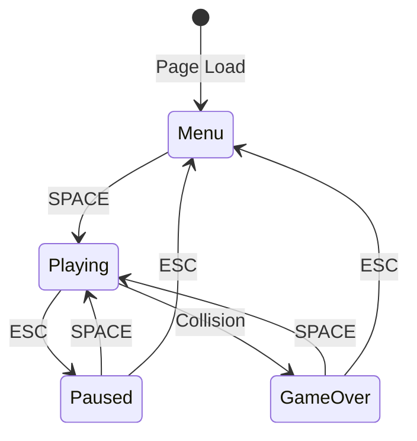

# UI Mockups and Interface Design

## Overview

This document defines the user interface layouts for Flappy Kiro across all game states. The design follows a retro aesthetic with clean typography, centered layouts, and clear visual hierarchy.

## Canvas Specifications

- **Canvas Size:** 800x600 pixels
- **Aspect Ratio:** 4:3
- **Background Color:** `#87CEEB` (Sky blue)
- **Text Rendering:** Pixel-perfect, no anti-aliasing
- **Font Family:** Monospace or pixel-art font (fallback to system monospace)

## Color Palette

### UI Colors (from game-config.json)
```javascript
{
  "background": "#87CEEB",  // Sky blue
  "pipe": "#4CAF50",        // Green
  "text": "white",          // Primary text
  "highlight": "yellow"     // Accent/high scores
}
```

### Additional UI Colors
- **Shadow/Outline:** `rgba(0, 0, 0, 0.5)` - Text shadows for readability
- **Button Hover:** `rgba(255, 255, 255, 0.2)` - Subtle highlight
- **Disabled:** `rgba(255, 255, 255, 0.5)` - Faded elements

## Typography Scale (from game-config.json)

```javascript
{
  "title": 72,        // Game title, major headings
  "gameOver": 64,     // Game over text
  "score": 48,        // In-game score display
  "highScore": 36,    // High score labels
  "instructions": 28, // Button text, instructions
  "small": 20         // Secondary text, hints
}
```

---

## 1. Main Menu Screen

### Layout

```
┌─────────────────────────────────────────────────────────────────┐
│                                                                 │
│                         FLAPPY KIRO                             │ ← 72px, white
│                        (Title, y=150)                           │
│                                                                 │
│                                                                 │
│                            👻                                   │ ← Ghosty sprite
│                        (y=250, idle animation)                  │
│                                                                 │
│                                                                 │
│                      High Score: 42                             │ ← 36px, yellow
│                         (y=340)                                 │
│                                                                 │
│                                                                 │
│                   Press SPACE to start                          │ ← 28px, white
│                         (y=420)                                 │
│                                                                 │
│                 SPACE / CLICK / TAP to jump                     │ ← 20px, white
│                         (y=460)                                 │
│                                                                 │
│                                                                 │
└─────────────────────────────────────────────────────────────────┘
     800x600px canvas
```

### Element Specifications

**Title Text:**
- Text: "FLAPPY KIRO"
- Font Size: 72px
- Color: White
- Position: Centered horizontally, y=150
- Effect: Text shadow (2px offset, black, 50% opacity)
- Animation: Optional subtle pulse (scale 1.0 → 1.05 → 1.0 over 2s)

**Ghosty Preview:**
- Sprite: 32x32px Ghosty character
- Position: Centered horizontally, y=250
- Animation: Idle state (4-frame loop)
- Scale: 2x (display at 64x64px for prominence)

**High Score Display:**
- Text: "High Score: [number]"
- Font Size: 36px
- Color: Yellow (`highlight`)
- Position: Centered horizontally, y=340
- Format: Integer, no decimal places
- Source: localStorage "flappyKiroHighScore"

**Start Instruction:**
- Text: "Press SPACE to start"
- Font Size: 28px
- Color: White
- Position: Centered horizontally, y=420
- Animation: Blink (fade 100% → 50% → 100% over 1.5s)

**Controls Hint:**
- Text: "SPACE / CLICK / TAP to jump"
- Font Size: 20px
- Color: White (80% opacity)
- Position: Centered horizontally, y=460
- Static (no animation)

### Interaction States

**Idle:**
- Display all elements as specified
- Ghosty plays idle animation
- Start instruction blinks

**Input Detected (SPACE pressed):**
- Fade out menu (200ms)
- Transition to playing state
- Start background music

---

## 2. In-Game HUD (Playing State)

### Layout

```
┌─────────────────────────────────────────────────────────────────┐
│                                                                 │
│                            42                                   │ ← Score (48px, white)
│                          (y=60)                                 │
│                                                                 │
│                                                                 │
│                                                                 │
│                                                                 │
│         [Gameplay area - pipes, ghost, particles]               │
│                                                                 │
│                                                                 │
│                                                                 │
│                                                                 │
│                                                                 │
│                                                                 │
└─────────────────────────────────────────────────────────────────┘
```

### Element Specifications

**Current Score:**
- Text: Score number only (e.g., "42")
- Font Size: 48px
- Color: White
- Position: Centered horizontally, y=60
- Effect: Text shadow (2px offset, black, 50% opacity)
- Update: Real-time as score increases
- Animation: Brief scale pulse (1.0 → 1.2 → 1.0 over 200ms) when score increases

**Score Indicators (+1 particles):**
- Text: "+1"
- Font Size: 32px
- Color: Yellow
- Position: At ghost position when scoring
- Animation: Float upward at 2px/frame, fade out over 30 frames
- Lifespan: 500ms (30 frames at 60 FPS)

### Minimal Design Philosophy

- No borders, buttons, or chrome
- Maximum screen space for gameplay
- Score is only persistent UI element
- Clean and uncluttered

---

## 3. Paused Screen

### Layout

```
┌─────────────────────────────────────────────────────────────────┐
│                                                                 │
│                            42                                   │ ← Score (dimmed)
│                                                                 │
│                                                                 │
│                                                                 │
│         [Gameplay area - frozen at 70% opacity]                 │
│                                                                 │
│                          PAUSED                                 │ ← 64px, white
│                         (y=250)                                 │
│                                                                 │
│                    Current Score: 42                            │ ← 28px, white
│                         (y=320)                                 │
│                                                                 │
│                   Press SPACE to resume                         │ ← 24px, white
│                         (y=380)                                 │
│                                                                 │
│                    Press ESC for menu                           │ ← 24px, white
│                         (y=420)                                 │
│                                                                 │
└─────────────────────────────────────────────────────────────────┘
```

### Element Specifications

**Background Overlay:**
- Semi-transparent dark overlay: `rgba(0, 0, 0, 0.3)`
- Covers entire canvas
- Game objects rendered at 70% opacity beneath

**Paused Text:**
- Text: "PAUSED"
- Font Size: 64px
- Color: White
- Position: Centered horizontally, y=250
- Effect: Text shadow (3px offset, black, 70% opacity)

**Current Score Display:**
- Text: "Current Score: [number]"
- Font Size: 28px
- Color: White
- Position: Centered horizontally, y=320

**Resume Instruction:**
- Text: "Press SPACE to resume"
- Font Size: 24px
- Color: White
- Position: Centered horizontally, y=380

**Menu Instruction:**
- Text: "Press ESC for menu"
- Font Size: 24px
- Color: White
- Position: Centered horizontally, y=420

### Interaction States

**Paused:**
- Game physics frozen
- Background music paused
- All game objects visible but dimmed

**Resume (SPACE pressed):**
- Fade out pause overlay (100ms)
- Resume game physics
- Resume background music

**Exit to Menu (ESC pressed):**
- Fade out to menu screen (200ms)
- Discard current game session
- Stop background music

---

## 4. Game Over Screen

### Layout

```
┌─────────────────────────────────────────────────────────────────┐
│                                                                 │
│                                                                 │
│                        GAME OVER                                │ ← 64px, white
│                         (y=150)                                 │
│                                                                 │
│                                                                 │
│                       Score: 42                                 │ ← 36px, white
│                         (y=230)                                 │
│                                                                 │
│                   Session Best: 58                              │ ← 28px, white
│                         (y=280)                                 │
│                                                                 │
│                  All-Time Best: 127                             │ ← 28px, yellow
│                         (y=320)                                 │
│                                                                 │
│                   [NEW HIGH SCORE!]                             │ ← 32px, yellow
│                  (y=360, conditional)                           │
│                                                                 │
│                                                                 │
│                 Press SPACE to restart                          │ ← 24px, white
│                         (y=440)                                 │
│                                                                 │
│                   Press ESC for menu                            │ ← 24px, white
│                         (y=480)                                 │
│                                                                 │
└─────────────────────────────────────────────────────────────────┘
```

### Element Specifications

**Background:**
- Game objects frozen in final positions
- Semi-transparent dark overlay: `rgba(0, 0, 0, 0.4)`

**Game Over Text:**
- Text: "GAME OVER"
- Font Size: 64px
- Color: White
- Position: Centered horizontally, y=150
- Effect: Text shadow (3px offset, black, 70% opacity)
- Animation: Fade in over 300ms

**Final Score:**
- Text: "Score: [number]"
- Font Size: 36px
- Color: White
- Position: Centered horizontally, y=230
- Effect: Text shadow (2px offset, black, 50% opacity)

**Session Best:**
- Text: "Session Best: [number]"
- Font Size: 28px
- Color: White
- Position: Centered horizontally, y=280
- Note: Highest score in current browser session

**All-Time Best:**
- Text: "All-Time Best: [number]"
- Font Size: 28px
- Color: Yellow (`highlight`)
- Position: Centered horizontally, y=320
- Note: Highest score ever (from localStorage)

**New High Score Banner (Conditional):**
- Text: "NEW HIGH SCORE!"
- Font Size: 32px
- Color: Yellow (`highlight`)
- Position: Centered horizontally, y=360
- Display: Only when final score equals all-time best
- Animation: Pulse scale (1.0 → 1.1 → 1.0 over 1s, continuous)
- Effect: Glow effect (optional)

**Restart Instruction:**
- Text: "Press SPACE to restart"
- Font Size: 24px
- Color: White
- Position: Centered horizontally, y=440
- Animation: Blink (fade 100% → 70% → 100% over 1.5s)

**Menu Instruction:**
- Text: "Press ESC for menu"
- Font Size: 24px
- Color: White
- Position: Centered horizontally, y=480

### Interaction States

**Game Over Display:**
- Show all statistics
- Highlight new high score if applicable
- Wait for player input

**Restart (SPACE pressed):**
- Fade out game over screen (200ms)
- Reset game state
- Start new game immediately
- Resume background music

**Return to Menu (ESC pressed):**
- Fade out to menu screen (200ms)
- Show updated high score on menu
- Stop background music

---

## Text Rendering Implementation

### Text Shadow Effect

```javascript
function drawTextWithShadow(ctx, text, x, y, fontSize, color, shadowOffset = 2) {
  ctx.font = `${fontSize}px monospace`;
  ctx.textAlign = 'center';
  ctx.textBaseline = 'middle';
  
  // Draw shadow
  ctx.fillStyle = 'rgba(0, 0, 0, 0.5)';
  ctx.fillText(text, x + shadowOffset, y + shadowOffset);
  
  // Draw main text
  ctx.fillStyle = color;
  ctx.fillText(text, x, y);
}
```

### Centered Text Helper

```javascript
function drawCenteredText(ctx, text, y, fontSize, color) {
  const x = canvas.width / 2;
  drawTextWithShadow(ctx, text, x, y, fontSize, color);
}
```

### Blinking Animation

```javascript
class BlinkingText {
  constructor(text, x, y, fontSize, color, period = 1500) {
    this.text = text;
    this.x = x;
    this.y = y;
    this.fontSize = fontSize;
    this.color = color;
    this.period = period;
    this.time = 0;
  }
  
  update(deltaTime) {
    this.time = (this.time + deltaTime) % this.period;
  }
  
  render(ctx) {
    const opacity = 0.5 + 0.5 * Math.sin((this.time / this.period) * Math.PI * 2);
    ctx.globalAlpha = opacity;
    drawTextWithShadow(ctx, this.text, this.x, this.y, this.fontSize, this.color);
    ctx.globalAlpha = 1.0;
  }
}
```

### Score Pulse Animation

```javascript
class ScorePulse {
  constructor() {
    this.scale = 1.0;
    this.animating = false;
    this.animationTime = 0;
    this.duration = 200; // ms
  }
  
  trigger() {
    this.animating = true;
    this.animationTime = 0;
  }
  
  update(deltaTime) {
    if (this.animating) {
      this.animationTime += deltaTime;
      const progress = this.animationTime / this.duration;
      
      if (progress < 0.5) {
        // Scale up
        this.scale = 1.0 + (progress * 2) * 0.2;
      } else {
        // Scale down
        this.scale = 1.2 - ((progress - 0.5) * 2) * 0.2;
      }
      
      if (progress >= 1.0) {
        this.scale = 1.0;
        this.animating = false;
      }
    }
  }
  
  render(ctx, text, x, y, fontSize, color) {
    ctx.save();
    ctx.translate(x, y);
    ctx.scale(this.scale, this.scale);
    ctx.translate(-x, -y);
    drawTextWithShadow(ctx, text, x, y, fontSize, color);
    ctx.restore();
  }
}
```

---

## Responsive Considerations

### Canvas Centering

```css
canvas {
  display: block;
  margin: 0 auto;
  background-color: #000;
  image-rendering: pixelated;
  image-rendering: crisp-edges;
}

body {
  margin: 0;
  padding: 20px;
  background-color: #1a1a1a;
  display: flex;
  justify-content: center;
  align-items: center;
  min-height: 100vh;
}
```

### Viewport Scaling (Optional)

```javascript
function scaleCanvas() {
  const canvas = document.getElementById('gameCanvas');
  const container = canvas.parentElement;
  
  const scaleX = container.clientWidth / canvas.width;
  const scaleY = container.clientHeight / canvas.height;
  const scale = Math.min(scaleX, scaleY, 1); // Don't scale up
  
  canvas.style.transform = `scale(${scale})`;
  canvas.style.transformOrigin = 'center center';
}

window.addEventListener('resize', scaleCanvas);
scaleCanvas();
```

---

## Accessibility Features

### Keyboard Navigation
- All interactions use keyboard (SPACE, ESC)
- No mouse-only functionality
- Clear visual feedback for all states

### Visual Clarity
- High contrast text (white on blue)
- Text shadows for readability
- Large, legible font sizes
- No flashing effects (only gentle fades/pulses)

### Screen Reader Support
```html
<canvas id="gameCanvas" 
        width="800" 
        height="600"
        role="application"
        aria-label="Flappy Kiro Game">
  <p>Flappy Kiro - A retro endless runner game. 
     Press SPACE to jump and navigate through pipes.</p>
</canvas>
```

---

## Animation Timing Reference

| Element | Animation | Duration | Easing |
|---------|-----------|----------|--------|
| Menu title | Pulse scale | 2000ms | Sine wave |
| Start instruction | Blink opacity | 1500ms | Sine wave |
| Score increase | Scale pulse | 200ms | Ease-out |
| Score indicator | Float + fade | 500ms | Linear |
| Menu transition | Fade out | 200ms | Linear |
| Pause overlay | Fade in | 100ms | Linear |
| Game over screen | Fade in | 300ms | Linear |
| High score banner | Pulse scale | 1000ms | Sine wave |

---

## UI State Diagram



---

## Testing Checklist

### Visual
- [ ] All text is readable against background
- [ ] Text shadows improve readability
- [ ] Font sizes match specifications
- [ ] Colors match game-config.json
- [ ] Layouts are centered correctly
- [ ] No text overflow or clipping

### Animation
- [ ] Menu title pulse is smooth
- [ ] Start instruction blinks at correct rate
- [ ] Score pulse triggers on increment
- [ ] Score indicators float and fade correctly
- [ ] High score banner pulses continuously
- [ ] All transitions are smooth (no jarring)

### Interaction
- [ ] SPACE key works in all states
- [ ] ESC key works in all states
- [ ] Mouse clicks work for jump (playing state)
- [ ] Touch taps work for jump (playing state)
- [ ] State transitions are immediate and clear

### Data Display
- [ ] High score loads from localStorage
- [ ] Current score updates in real-time
- [ ] Session best tracks correctly
- [ ] All-time best persists across sessions
- [ ] New high score banner shows only when appropriate

---

## References

- Requirements: See `.kiro/specs/flappy-kiro/requirements.md` sections 6, 7, 9
- Design: See `.kiro/specs/flappy-kiro/design.md` UI rendering section
- Configuration: See `config/game-config.json` UI section
- Typography: All font sizes defined in game-config.json
- Colors: All colors defined in game-config.json
